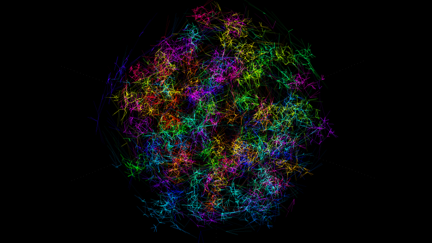
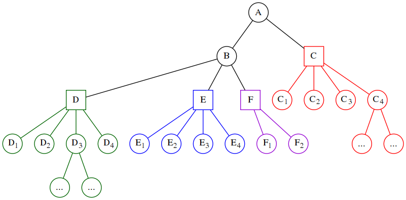

# openacc-openmp-tutorial
This is an advanced tutorial to OpenACC and OpenMP.

After completing this tutorial you will have gained the required expertise to leverage OpenACC and OpenMP for parallelization and acceleration of your application.
You are going to work on a simple simulation-type application which features some of the typical difficulties found in real-world applications. The tutorial is organized as multiple smaller but non-trivial steps. Each step provides learning material with simple code examples and a set tasks and goals to fulfill.

## Organization

Each step in the tutorial is realized as a branch of this repository. A fresh check-out of each next step contains the suggested solution of the current step's tasks. So in your own interest, only peek ahead if you are stuck. The scheme is as follows:
* [master](../../blob/master/README.md) - vanilla application, single threaded
* [step1](../../blob/step1/step.md) - CPU profiling and loop-parallelization via OpenMP
* [step2](../../blob/step2/step.md) - have a trivially parallelizable loop executed on a GPU via OpenACC
* [step3](../../blob/step3/step.md) - sectioning via NVTX markers, accelerate a non-trivial loop via OpenACC, kernel profile analysis
* [step4](../../blob/step4/step.md) - resolve a warp divergence slowdown, extended OpenACC data regions, optimizing nested loops
* [step5](../../blob/step5/step.md) - overlap host and device computation and communication
* [step6](../../blob/step6/step.md) - congratulations

## Application Description

We have insects floating in three-dimensional space.
They are special:
* They don't like each other very much, so each one tries to fly away from each other one. This is realized by a standard repulsive force (aka. Coulomb force)
* They organize themselves hierarchically: Each insect has a parent and a number of children.
  * Therefore each insect strives to keep close distance to its parent. This is realized by a spring force (of non-zero relaxed distance) between child and parent.
* All of them are trapped inside three-dimensional bowl, so they have to interact with each other. This is realized by a small spring to the center of the bowl.
* Some of the insects are more special than others: They are leader-insects.
  * They command all of their descendants (children, and their children, and their ...) to attack all of this leader's current enemy-insects
  * Enemy-insects of a leader are all insects closer to the leader than a specific attack-radius which themselves have a different leader
* An attacking insects flies towards each of its enemies. In turn the attacked insect defends by flying away. This is realized by a standard attractive/repulsive force (also Coulomb force, different strengths for attack/defend). 
  * A fight is realized by a mass transfer between the opponents: The heavier getting heavier, and the lighter getting lighter.
  * In case the attacking insect looses, that is, it becomes (a specific factor) lighter than its opponent, it deserts to the opponents leader, becoming a child of the defendant and receives a specific desertion-(mass)-reward from the defendant.

The application uses the leap-frog method to iterate insect coordinates, velocities and masses over time, and renders an image for each time-step. Here's a video of the resulting dynamics:

[](https://youtu.be/kSJTehI57x4)

### Data Structures
Following graph shows an example hierarchy of such insects. Each insect has exactly one parent, with the exception of insect A, which is the root of this leader-ship graph. Insects C, D, E and F are leader insects, and depicted using a square node, akin to regular insects which are depicted using a circular node. Each leader commands all of the insects reporting to it, visualized using a different color for each leader. For this graph, the insects following leader D (the green ones) have as enemies the insects of leader E (the blue ones), F (the violet ones) and C (the red ones), and would attack each of those if they are closer leader D than some attack-radius.


The file [model.h](model.h) contains the definitions of the data structures used for the simulation. Here's a quick excerpt:
```C
struct insect_data {
	float x,y,z,vx,vy,vz,m;      // 3D coordinates and velocities and mass
	int parent;                  // index to the parent insect
	int nchildren;               // number of children
	int children[MAX_CHILDREN];  // indices of the children
	int leader_idx;              // index to the leader insect
	int leader_id;               // the leader insect's index in leaders[]
} *insects;

struct leader_data {
	int id;                      // the leader's index in leaders[]
	int insect_idx;              // the leader's index in insects[]
	float hue;                   // hue value for color of the leader's insects
} *leaders;

struct insect_action_data {
	float fx,fy,fz,rm;           // 3D forces, and mass rate
	int new_parent;              // index of new parent in next iteration
} *actions;
```

In order to make yourself familiar with the simulation of these insects, start looking at the source code files [main.c](main.c), [model.h](model.h), [model.c](model.c).

From here just start with [Step 1](../../blob/step1/step.md).

## License
[Apache License 2.0](LICENSE)
