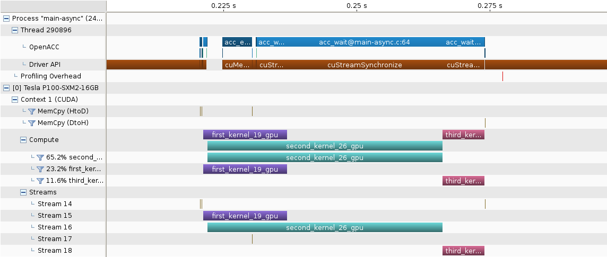
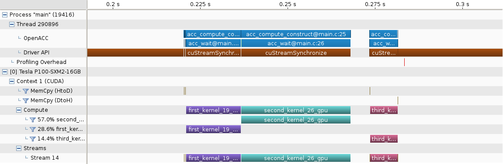
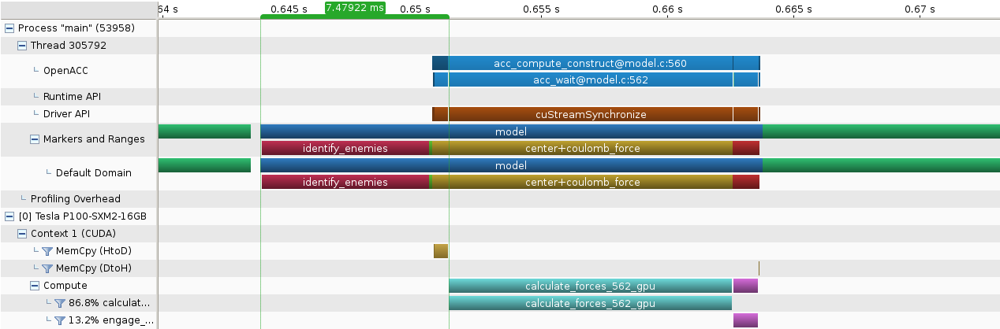
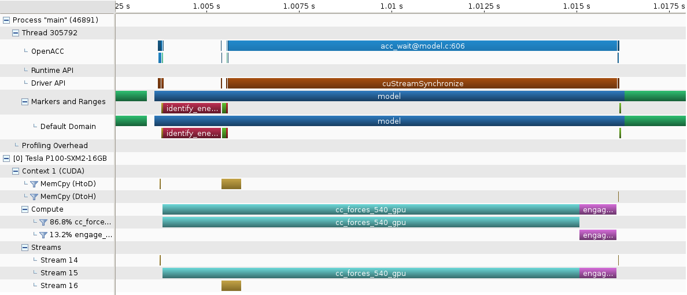

# openacc-openmp-tutorial
This is an advanced tutorial to OpenACC and OpenMP.

## Step 5
In this step we are going to 
* overlap host and device computation and communication

### asynchroneous OpenACC
Just like in CUDA, using so-called *CUDA-streams*, OpenACC offers the ability to run multiple device kernels at the same time in parallel to each other, using so-called *async queues*.
We enlarge the previous example from [Step 4](../../blob/step4/step.md) in the subfolder [acc-example](acc-example), and now have 3 device kernels `first_kernel`, `second_kernel`, `third_kernel` and a single `host_kernel`.
The `third_kernel` depends on output of `host_kernel, first_kernel, second_kernel`, which in turn are independent of each other and therefore can, in priciple, run parallel to each other.
The listing below is the parallelized version from file [acc-example/main-async.c](acc-example/main-async.c), the serial version may be found in file [acc-example/main.c](acc-example/main.c)

With OpenACC, most directies can take the additional argument `async(queue)` and `wait(queue-list)` where `queue` is an integer identfying so-called *async queues*, and `queue-list` is a comma-separated list of these.
Using these, each execution of a kernel or transfer can be forced
* to wait for completion of existing entries in the async queues specifed by `queue-list`,
* and then to run in a specific async queue `queue`,
Additionally there is a `#pragma acc wait` which acts like a barrier to completion of all oustanding queue-entries.

In the listing below, look for these, and compare the serial and parallel versions of the file:
```C
#define N 65536

float *w, a[4] = {0};
#pragma acc declare copyin(a)

#pragma acc routine
float series(float x, const float *z, const float *w) {
	float r=0;
	for (int i=0;i<N;i++) 
		r += (((z[i]*x+a[0])*x+a[1])*x+a[2])*x+a[3]+w[i]*x;
	return r;
}

void first_kernel(float *y, const float *z, const float *w) {
#pragma acc data async(1) present(y[0:N],z[0:N],w[0:N])
#pragma acc kernels async(1)
	for (int i=0;i<N;i++)
		y[i]=series(i,z,w);
}

void second_kernel(float *y, const float *z, const float *w) {
#pragma acc data async(2) present(y[0:N],z[0:N],w[0:N])
#pragma acc kernels async(2)
	for (int i=0;i<N;i+=64)
	for (int j=0;j<N;j+=64)
#pragma acc atomic
		y[(i*j)%N]+=z[i]*w[j];
}

void third_kernel(float *y, const float *z, const float *w, const float *x) {
#pragma acc data async(4) wait(1,2,3) present(y[0:N],z[0:N],w[0:N])
#pragma acc kernels async(4)
	for (int i=0;i<N;i++)
		y[i]=z[i]*w[i]*x[i];
}

void host_kernel(float *y, const float *z, const float *w) {
	for (int i=0;i<N;i++)
		y[i]=log(abs(sin(z[i])+cos(w[i])));
}

int main() {
        float y[N], y1[N], y2[N], y3[N], z[N]={1};
	w=malloc(sizeof(*w)*N); w[0]=1;
	a[0]=1; a[1]=2; a[2]=3; a[3]=4;
#pragma acc update device(a)
// define data region
// on entry create fields w[0:N], z[0:N] on device by copy-in from host
// on entry create uninitialized field y[0:N] on device, copy-out on exit
// on entry create uninitialized fields y1[0:N], y2[0:N] on device
#pragma acc data copyin(w[0:N],z[0:N])  \
                 copyout(y[0:N]) \
                 create(y1[0:N],y2[0:N])
    {
	first_kernel(y1,z,w);
	second_kernel(y2,z,w);
	host_kernel(y3,z,w);
#pragma acc data async(3) copyin(y3[0:N])
	third_kernel(y,y1,y2,y3);
#pragma acc wait
    }
}
```
Below a screenshot of what the timeline of an execution of the serial (i.e., non-parallelized) version:


Below a screenshot of what the timeline of an execution of the parallelized version:

As you can see the serial version executed kernels `first_kernel`, `second_kernel`, `host_kernel`, `data copy` and `third_kernel` serially, not utilizing many of the available compute resources on host and device.

The parallel version however starts `first_kernel`, `second_kernel` and `host_kernel` right at the beginning of the data region. The execution of the `data copy` is done when the function call to `host_kernel` has returned. And the execution of `third_kernel` is delayed untils all its dependencies are available, in this case async-queues 1,2 and 3.

### Your Tasks
Below a screenshot of the NVIDIA Visual Profiler, of the timeline of a single iteration from the start of this Step 5.

As you can see, `identify_enemies` being executed on the CPU takes ~6.6ms, and including data transfers, the first execution of the GPU happens only ~7.5ms after the start of the iteration, which takes ~20ms.
So during the first "half" of the iteration, computation is done only on the CPU, the GPU being idle, and during the second "half" of the iteration, computation is done only on the GPU, the CPU being idle.
This means a weak ~50% resource utilization.
* Using asynchronous OpenACC parallel regions, overlap host and device computation, such that `identify_enemies` and `center+coulomb_force` run in parallel.
* Use asynchronous data transfers and asynchronous waits make the array `leaders[]` available to device-kernel `engage` before this kernel starts.

### Hints
* The section `tree_force` is the only remaining host-computation that changes `actions[]`, while `engage` is the only device-computation that changes `actions[].new_parent`. Since we used OpenACC to duplicate this array onto the device, that means that on host and device, separate arrays `actions[]` are being used to accumulate forces. Exiting the OpenACC parallel region will copy back `actions[]`to the host, overwriting the host's results.
  * These two arrays need to merged properly into one host-array before the code may continue regular execution. Uncomment the commented calls to `setup_device_actions()` and `merge_device_actions()`, then transfer `device_actions` instead of `actions`.
* In the end the NVIDIA Visual Profiler should show the following timeline: 
  
  Goal is to bring down total model run time to 0.22s. Again use `make results` to track your progress.


## Next Step
Continue with [Step 6](../../blob/step6/step.md)


