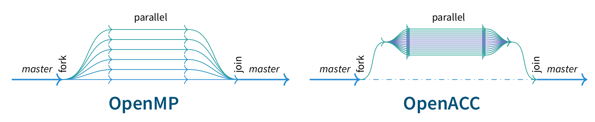

# openacc-openmp-tutorial
This is an advanced tutorial to OpenACC and OpenMP.

## Step 2
In this step we are going to use OpenACC to have a trivially parallelizable loop executed on a GPU.

### Literature
* [OpenACC Website](https://www.openacc.org)
* [OpenACC 2.6 ReferenceGuide](https://www.openacc.org/sites/default/files/inline-files/OpenACC%20API%202.6%20Reference%20Guide.pdf)
* [OpenACC 2.6 API Specification](https://www.openacc.org/sites/default/files/inline-files/OpenACC.2.6.final.pdf)
* [Excellent Tutorial on OpenACC](https://nval.andreasherten.de/talks/2017-08-31-gridka-openacc-tutorial--handout.pdf)

### OpenACC
Annotations to program source code that suggest to a compiler to execute code in so-called *ACC regions* in a specific parallel way *using an accelerator device* like a GPU.
Additionally there are executable annotations that instruct the compiler to transfer data to the device or from the device.
For each ACC region, the CPU thread
* eventually transfers required data to the device,
* runs the code on the device,
* waiting for completion of execution,
* eventually transfers data back to the host,

before resuming with execution of regular host code.


The subdirectory [acc-example](acc-example) contains following example code you can play with and extend:
```C
#define N 65536

float *w, a[4] = {0};
#pragma acc declare copyin(a)       // create memory space for variable a on device and copy to device once

#pragma acc routine                 // now function may be called from ACC region
float series(float x, const float *z, const float *w) {
	float r=0;
	for (int i=0;i<N;i++) 
		r += (((z[i]*x+a[0])*x+a[1])*x+a[2])*x+a[3]+w[i]*x;
	return r;
}

int main() {
        float y[N], z[N]={1};
	w=malloc(sizeof(*w)*N); w[0]=1;
	a[0]=1; a[1]=2; a[2]=3; a[3]=4;
#pragma acc update device(a)        // update variable a on device by those on host
#pragma acc data copyin(w[0:N])     // define data region; on entry create field w[0:N] on device by copying from host
#pragma acc kernels                 // execution of code-block on GPU, compiler tries to derive appropriate method
   	{
	        for (int i=0;i<N;i++)
        	        y[i]=series(i,z,w);
	}
}
```
Now let's compile this code:
```
[user@host acc-example]$ make
pgcc -mp -O3 -fast -ta=tesla:cc35,cc60,cuda9.0,pinned -Minfo=accel,inline -c main.c -o main.o
PGC-W-0095-Type cast required for this conversion (main.c: 16)
PGC-W-0155-Pointer value created from a nonlong integral type  (main.c: 16)
series:
      7, Generating acc routine seq
         Generating Tesla code
main:
     19, Generating update device(a[:])
         Generating copyin(w[:65536])
     20, Generating implicit copy(z[:])
         Generating implicit copyout(y[:])
     22, Loop is parallelizable
         Accelerator kernel generated
         Generating Tesla code
         22, #pragma acc loop gang, vector(128) /* blockIdx.x threadIdx.x */
PGC/power Linux 17.10-0: compilation completed with warnings
pgcc -mp -ta=tesla:cc35,cc60,cuda9.0,pinned -Minfo=accel,inline main.o -o main
```
As can be seen above, the compiler infers
* a full copy of field `z[:]`, i.e. a copy-in on region-entry and a copy-out on region-exit,
* a full copy-out on region-exit for field `y[:]`.
* The loop is parallelizable
  * and parallelized using `gang, vector(128)`, meaning
  * each *thread* calculates the work of a single loop iteration,
  * 128 of these threads form a *vector* (OpenACC nomenclature) or *block* (CUDA nomenclature),
  * remaining parallelism is covered by executing as many as necessary of such *blocks* in a *grid* (CUDA nomenclature) or *gang* (OpenACC nomenclature).

### Tools
* PGI compiler shows results from OpenACC directives when adding flag `-Minfo=accel,inline`.
* Debugging an application using OpenACC or CUDA needs the CUDA-enabled debugger `cuda-gdb`. Or just run `make run-debug`.
* Profiling an application using OpenACC or CUDA can be done using the nvidia-profiler `nvprof`. Or just run `make run-nvprof`.
  * Show results in a console using `nvprof -i profile.nvvp [--print-gpu-trace]`. Here's a listing of the output:
```
[user@host acc-example]$ nvprof -i profile.nvvp
======== Profiling result:
            Type  Time(%)      Time     Calls       Avg       Min       Max  Name
 GPU activities:   99.73%  15.782ms         1  15.782ms  15.782ms  15.782ms  main_22_gpu
                    0.16%  24.741us         4  6.1850us     512ns  11.907us  [CUDA memcpy HtoD]
                    0.11%  18.082us         2  9.0410us  8.1610us  9.9210us  [CUDA memcpy DtoH]
      API calls:   57.15%  125.73ms         1  125.73ms  125.73ms  125.73ms  cuDevicePrimaryCtxRetain
                   31.85%  70.068ms         1  70.068ms  70.068ms  70.068ms  cuDevicePrimaryCtxRelease
                    7.19%  15.808ms         5  3.1616ms  2.7990us  15.779ms  cuStreamSynchronize
                    2.67%  5.8778ms         1  5.8778ms  5.8778ms  5.8778ms  cuMemHostAlloc
                    0.57%  1.2464ms         1  1.2464ms  1.2464ms  1.2464ms  cuMemFreeHost
                    0.22%  482.10us         4  120.53us  5.6460us  257.73us  cuMemAlloc
                    0.20%  434.28us         1  434.28us  434.28us  434.28us  cuMemAllocHost
[...]
 OpenACC (excl):   69.60%  15.782ms         1  15.782ms  15.782ms  15.782ms  acc_wait@main.c:22
                   26.92%  6.1034ms         1  6.1034ms  6.1034ms  6.1034ms  acc_device_init@main.c:19
                    1.43%  323.25us         1  323.25us  323.25us  323.25us  acc_enter_data@main.c:19
                    0.47%  105.98us         1  105.98us  105.98us  105.98us  acc_wait@main.c:25
                    0.30%  68.711us         3  22.903us  9.7320us  44.852us  acc_enqueue_upload@main.c:19
                    0.24%  54.145us         1  54.145us  54.145us  54.145us  acc_enter_data@main.c:20
[...]
[user@host acc-example]$ nvprof -i profile.nvvp --print-gpu-trace
======== Profiling result:
   Start  Duration  Grid Size  Block Size  Regs*  SSMem*  DSMem*   Size  Throughput  SrcMemType  DstMemType     Device  Context  Stream  Name
     0ns     704ns          -           -      -       -       -    16B  21.674MB/s      Pinned      Device  P100-SXM2        1      14  [CUDA memcpy HtoD]
49.993us     512ns          -           -      -       -       -    16B  29.802MB/s      Pinned      Device  P100-SXM2        1      14  [CUDA memcpy HtoD]
406.98us  11.907us          -           -      -       -       -  256KB  20.504GB/s      Pinned      Device  P100-SXM2        1      14  [CUDA memcpy HtoD]
484.63us  11.618us          -           -      -       -       -  256KB  21.014GB/s      Pinned      Device  P100-SXM2        1      14  [CUDA memcpy HtoD]
571.08us  15.782ms  (512 1 1)   (128 1 1)     47      0B      0B      -           -           -           -  P100-SXM2        1      14  main_22_gpu [59]
16.388ms  9.9210us          -           -      -       -       -  256KB  24.608GB/s      Device      Pinned  P100-SXM2        1      14  [CUDA memcpy DtoH]
16.429ms  8.1610us          -           -      -       -       -  256KB  29.916GB/s      Device      Pinned  P100-SXM2        1      14  [CUDA memcpy DtoH]
```
  * Show results in a GUI using `nvvp profile.nvvp`. Here's a screenshot from above example:
    

### Your Tasks
In [model.c](model.c), function `calculate_forces` calls functions `center_force` and `coulomb_repell` for each insect. As you may have realized in [Step 1](../../blob/step1/step.md), both functions only change the members of the same insect's `actions[i]`. The following loop can be therefore be trivially parallelized:
```C
for (int i=0;i<NumInsects;i++) {
	center_force(i);
	coulomb_repell(i);
}
```
* Execute the loop on the GPU using OpenACC. Try to bring down total model execution time from ~4.1sec to ~2.8sec, or ~11ms per GPU-kernel invocation.
* In order to check your progress, again use `make results`, and use the NVIDIA Visual Profiler to show profiles generated by `nvprof`.
* Hints:
  * Directives for data transfer operations exist in a variety of variants: `#pragma acc data (create|copyin|copyout|copy|present|...)`, where copy means copyin and copyout.
  * Directives of type `#pragma acc declare (create|copyin|...)` work well for global block variables like intrinsic types and structs. They also work for pointers, but what is created on the device is a variable that contains the value of the pointer, and no more.
  * It may be that the compiler has a hard time believing that a loop is parallelizable. Such a belief may be overridden using a `#pragma acc loop independent` in the line preceding the loop.
* Optional:
  *  Use `nvvp` to inspect host-to-device and device-to-host transfer sizes and throughputs, kernel register count, grid-size, block-size, etc... and verify that the values are just as you expected.
  * In the `Makefile` the PGI compiler is configured with the flag `-ta=tesla:pinned`. See if you can use change the mode from `pinned` to `managed` in order to avoid explicitly transferring the fields to/from the device.

## Next Step
Continue with [Step 3](../../blob/step3/step.md)


